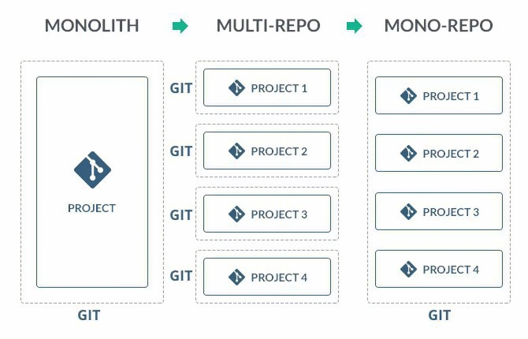

##### Introduction
What is a monorepo ?

A monorepo is a code repository that holds multiple applications.
These applications can be related or completely independent.
It also allows us to share code among these application without using any kind of package manager.
It should be noted that a monorepo is not a monolith. A monolith is huge amount of coupled code of a single application in a single repository.

##### Pros of a monorepo:
1. __One source of truth:__ Instead of having multiple repositories  we have a single repository with all the code and configurations to manage it.

1. __Consistent dependency management:__ code is shared in a monorepo, so are our dependencies, That means all your application will have the same versions of the libraries they need. There are no versioning conflicts or dependency hell.

1. __Consistent coding practices:__ enforcing code quality standards and a unified style is easier when you have all your code in one place. For example, having a single configuration for all dev tools like code linters, code formatters, testing configuration etc,

1. __Visibility:__ the entire code is visible to everyone. This enables cross team collaboration.

4. __Code reuse:__ common modules, shared libraries, and helper utilities are all in the same repository, teams can use them in any application. All the boilerplate code can be extracted out, so developers can focus on business logic rather than the structure and design of shared utilities.

5. __Adding a new project/application:__ it becomes extremely easy to add a new project to the repository since all the dependencies, utilities, CI/CD, Git, and test runners are already included.

6. __Breaking changes are easy to tackle:__ breaking changes in shared packages/dependencies are communicated immediately.
.
7. __Unified CI/CD:__ For each application, you can use the same CI/CD and deployment process.

8. __Unified build process:__ we can have a single build process to build all the applications, thus increasing the consistency of the final builds.

##### Cons of monorepo
1. __Poor Git performance:__ when monorepo reaches tens of thousands of files, and extremely huge number of commits git performance gets impacted.

1. __Broken master:__  if for some reason, your master/main branch is broken, all the projects might be impacted.

1. __Learning curve:__  for new joiners, it has a learning curve since the codebase is a little intimidating.

1. __Ownership:__ code ownership becomes difficult because anyone can come and edit your code.

1. __Code reviews:__ code reviews may become a little difficult if changes are made across multiple packages at once.

1. __Testing:__ This isn't actually a disadvantage. However, you must ensure that your reusable packages are thoroughly tested and that automated testing is in place.

1. __Unable to restrict access:__ Every member who has access to the repository will have access to all the applications. There’s no way to restrict some applications, which is irrelevant to the developer.

##### Why was multirepo a problem for Healthifyme web team?
Our web team builds a wide range of applications, including internal projects, client-facing applications, webviews for our native applications, marketing pages, and other web experiments etc. Most of these applications are built with modern frontend frameworks/libraries such as ReactJs.

Building multiple applications with modern dev tools comes with its own set of requirements:

* Common utilities (Authentication, Authorization, http, storage, logging, error handling, image managers, cdn, etc)
* Reusable UI components (Consistent Ui Library).
* Dependency management (yarn, npm)
* Testing (Jest, React testing library, msw, etc)
* Transpilation (Babel)
* Builder/Bundler (Webpack)
* Code linter (Eslint)
* Code formatter (Prettier)
* BFF (NodeJs with Express).
* Server side utilities (Authentication, RPC's, etc).
* Scripts (common scripts to run above mentioned tools)
* Dockerization
* CI/CD
* Deployment
* Maintaining reusable npm packages, updating them and making sure all applications
are on the latest versions.
* Repetitive boilerplate code

It is evident from the preceding statements that managing a large number of applications in a fast-paced startup is a repetitive and a tedious job. In addition, each project contains a lot of boilerplate code. With monorepo, we could entirely eliminate all development dependencies and concentrate just on the application and business logic.

##### Enter Healthifyme Athena
Roughly in February 2019, we started an ambitious web project called Athena. Which amimed
to solve all the above problems by creating a unified codebase for future web projects.
Back in 2019, the only tool that could manage workspaces was [Lerna](https://github.com/lerna/lerna) and yarn [Workspaces](https://classic.yarnpkg.com/lang/en/docs/cli/workspaces/)

We started our monorepo with Lerna because it had all of the capabilities we needed. For approximately two years, everything was well, however lerna had some active maintenance concerns. We opted to step away from the project because there was no active development going on. Currently, our repository uses Yarn workspaces, which allows us to embrace any new tool in the future without requiring a larger migration strategy.

##### Today, Athena holds
* 17 packages
* 40+ applications (small, medium, and large-sized)
* 70+ Ui Components
* 100+ Global Icons
* Nodejs + express applications
* Remix-Run application.
* Common React hooks
* Global Constants
* Chrome/Firefox extensions
* Common Utilities
* Test Utilities
* Style Utilities
* Server Utilities
* Configurations
  * Babel
  * Eslint
  * Prettier
  * Jest
  * Testing library react
  * Webpack
  * Prettier
  * Storybook
  * Github
  * Docker
  * CI/CD
* Development scripts
* Unified Build & test configuration

##### Some major advantages we have right now
* It is simple to start a new React project. boilerplate is automatically generated.
* There is no webpack, babel, or jest to configure. It's already configured.
* There is no need to figure out javascript libraries for your application. For example for charts, date time, http, graphql, styles etc. it's already there.
* There is no need to figure out how authentication will works. Its already solved by our http package
* There is no need to figure out how to theme your front-end app.
* Every reusable package has Unit and Integration tests. it is easy to make changes to these packages and have confidence in your changes.
* Cross team colab becomes easy. Anyone from the backend or any other team wants to create an application, it’s just one command away.
* No mental overhead of learning the entire front-end process, build tools, transpilers etc
* Our dependency management has become extremely simple.
* All our apps have the exact same version of libraries and frameworks like Node, Express, React, Jest, Styled components etc.
* It is easy to update all of these packages at once.
* The unified build system ensures that each and every application has exactly the same build configuration . it gives us confidence in the output build of each and every application.
* It becomes easy to experiment with better development tools. For example, to replace babel with swc. or maybe webpack with esbuild.
* Deployment is already taken care of.

##### Future scope
Monorepo has received a lot of attention recently. Plenty of new tools have been created to help with monorepo design patterns. We'd definitely try out a few of these tools to see how they could help us manage such a large repository better.
Some of the tools worth considering are :
* NX
* RushJs
* Turborepo
* Bazel

##### Conclusion
Monorepo design is simply another approach to application development. It may not be the best way to build or design applications for your specific use case, but it has greatly simplified the lives of our developers. If you find yourself in a situation where you need to build multiple applications, you should definitely consider monorepos.

##### Also read

[How to integrate Instagram/Snapchat style stories into your ReactJs application](/how-to-integrate-instagram-snapchat-style-stories-into-your-react-js-application)

[How to Dockerize a Remix App](/how-to-dockerize-a-remix-app)

[Top Neovim plugins for developers in 2022](/top-neovim-plugins-for-developers-in-2022)
