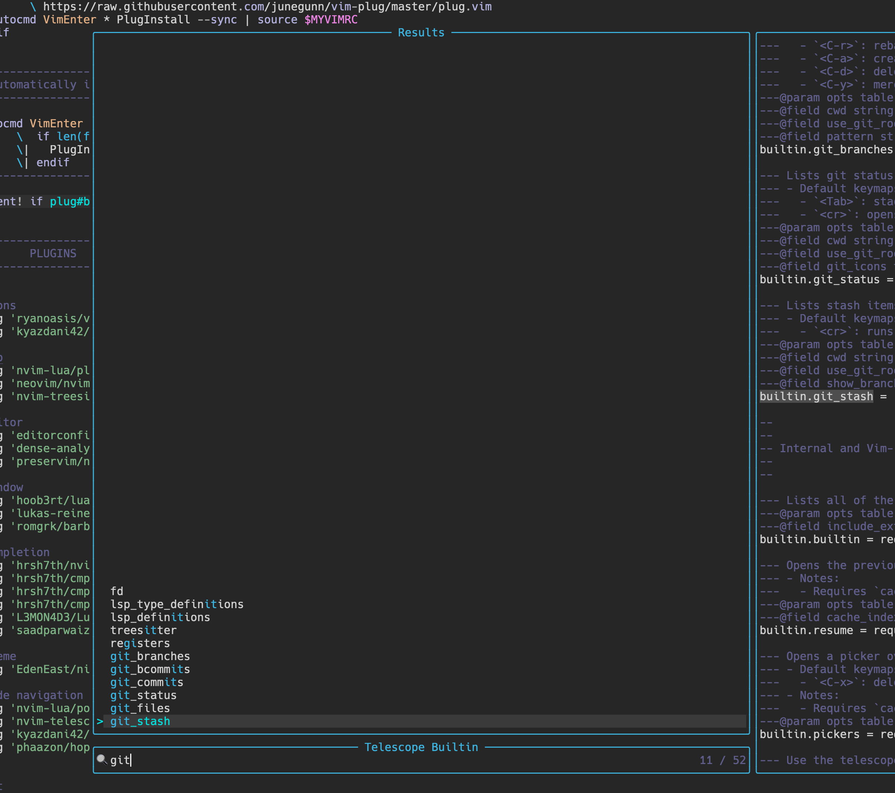
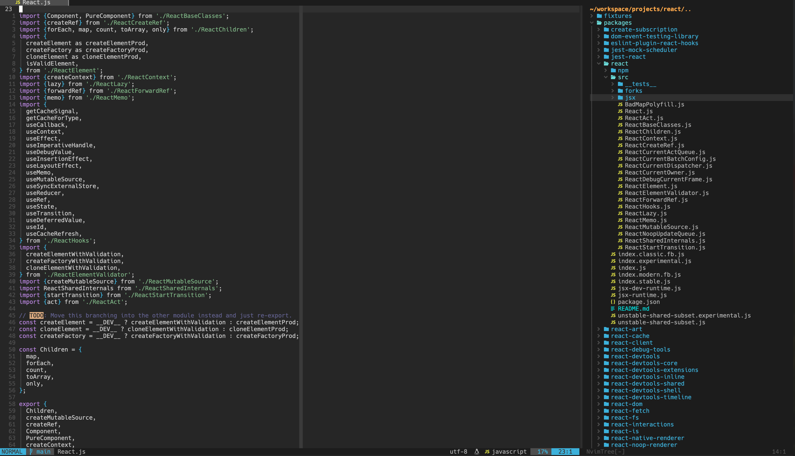
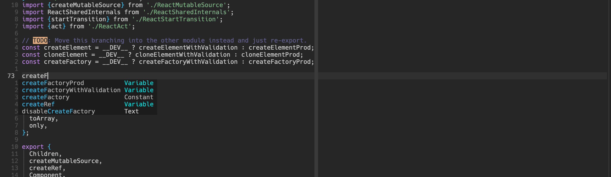
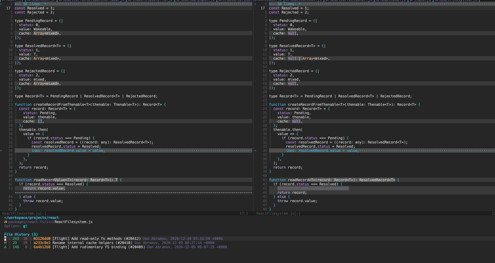
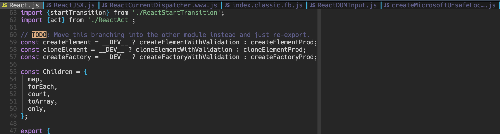

##### Introduction
If you code a little bit, you already know some text editors or IDE’s that help you with your daily development, like VsCode, Atom, Sublime Text, Webstorm, Pycharm, IntelliJ IDEA, Visual Studio, etc. They are all excellent at code formatting, syntactical analysis, integrated terminal, testing, plugins manager, and so on.

##### Introducing Neovim
[Neovim](https://neovim.io/) is a fork of [Vim](https://www.vim.org/) that is an improved clone of [Vi](https://en.wikipedia.org/wiki/Vi). The original Vi code was written by [Bill Joy](https://en.wikipedia.org/wiki/Bill_Joy) in 1976.

Neovim is aiming to improve the codebase, allowing for easier implementation of APIs, improved user experience, and plugin implementation.

##### Why is NeoVim a good option for developers?

- It's open source and free.
- Blazingly fast.
- Customizable with a huge ecosystem of plugins.
- Treesitter and Language Server Protocol (LSP) are supported, but some configuration is required.
- It is a cross-platform software, it works pretty much everywhere (Linux, Windows, and macOS).
- Everything you'll ever do in Vim will be done with your keyboard. Say goodbye to your mouse.
- It runs in your terminal.
- Low CPU/RAM usage.

The only downside to using Neovim/Vim is that you need to invest a good amount of time learning and configuring it.
There is an initial learning curve. But once you pass that time, your productivity increases exponentially.

This blog is not about how awesome Neovim/Vim is. Maybe I will write another blog some other time.
So here are the top neovim plugins that every developer needs.

Disclaimer: I am using the [Reactjs](https://reactjs.org) open source project to showcase different plugins in this post.

1. [Vim Plug](https://github.com/junegunn/vim-plug)

   Vim Plug is a free, open source, very fast and minimalist vim plugin manager.

2. [Nvim LSP Config](https://github.com/neovim/nvim-lspconfig)

   A collection of common configurations for Neovim's built-in language server client.

3. [Nvim Treesitter](https://github.com/nvim-treesitter/nvim-treesitter)

   Treesitter aims to provide better syntax highlighting for your code.
   
   Traditional highlighting (left) vs Treesitter-based highlighting (right).

4. [Telescope](https://github.com/nvim-telescope/telescope.nvim)

   Telescope is a highly extendable fuzzy finder. You can search your files, search within files, etc. with this plugin.
   
   
   Telescope also allows you to search within git lists.

5. [Nvim Tree](https://github.com/kyazdani42/nvim-tree.lua)

    File Explorer For Neovim Written In Lua.
   

6. [Nvim cmp](https://github.com/hrsh7th/nvim-cmp)

  A completion engine plugin for Neovim written in Lua.
   

7. [Editorconfig](https://github.com/editorconfig/editorconfig-vim)

   Editor config for Neovim.
   

8. [Ale](https://github.com/dense-analysis/ale)

   You can use Ale with existing linters and fixers like [Eslint](https://eslint.org), [Prettier](https://prettier.io), [Black](https://github.com/psf/black), [Rust fmt](https://github.com/rust-lang/rustfmt) etc.
   

9. [Nightfox theme](https://github.com/EdenEast/nightfox.nvim)

   Night mode theme for nvim
   

10. [Hop](https://github.com/phaazon/hop.nvim)

    Hop allows you to jump anywhere in a document with as few keystrokes as possible.
   

11. [diffview.nvim](https://github.com/sindrets/diffview.nvim)

    Single tabpage interface for easily cycling through git diffs
   

12. [Nerdcommenter](https://github.com/preservim/nerdcommenter)

    Comment a single or multiple lines with this plugin.
   

13. [Lualine](https://github.com/nvim-lualine/lualine.nvim)

    A blazing fast and easy to configure Neovim statusline written in Lua.
   

14. [Indent-blank line](https://github.com/lukas-reineke/indent-blankline.nvim)

    This plugin adds indentation guides to all lines (including empty lines).
   

15. [Barbar](https://github.com/romgrk/barbar.nvim)

    Barbar is a plugin for managing tabs in your Neovim editor.
   

I hope that this blog post helped you in setting up your vim workflow.

If you know of any great plugins that I've overlooked, please share them with me on my [Twitter](https://twitter.com/hannad_rehman) page.

